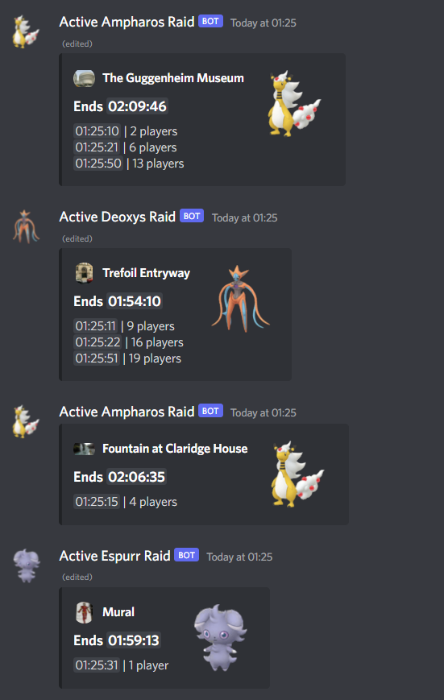

# Raid Watcher
 
⚠️ Proof of concept. This will most likely not work with your system.



Raid Watcher takes in raw protos (GetRaidDetails and GymGetInfo) and sends 
notifications to Discord if the lobby size changed. As pictured above. 
It will keep these messages updated if the player count changes.

### Setup

- Clone, `pip install -r requirements.txt`,
`cp config.example.toml config.toml` and fill out the config
- I think this requires at least Python 3.10, though 3.9 could work too
- Redirect any raw protos to `http://<host>:<port>/raw`. They must be 
POST-requests with the body looking as follows.

```js
{
    "contents": [
        {
            "type": 1,      // method id
            "payload": ""   // raw message
        },
        // ...
    ]
}
```
